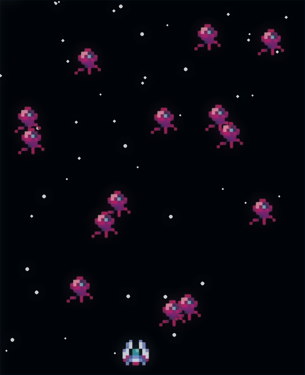
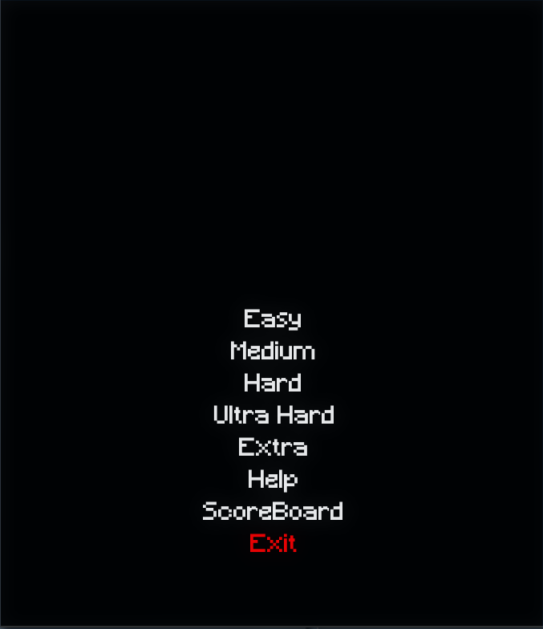

# Space Invaders

**Space Invaders** — это классическая аркадная игра, в которой вы набираете очки, стреляя по инопланетным врагам. Управляя космическим кораблем, вам предстоит уничтожать врагов и уворачиваться от их атак.

**Space Invaders** is a classic arcade game where you score points by shooting at alien enemies. You control a spaceship to destroy enemies and dodge their attacks.

---

## О игре / About the game

- **Несколько уровней сложности / Several difficulty levels**.
- **Рейтинг и таблица рекордов для каждого уровня сложности / Rating and high score table for each difficulty level**.
- Игра может быть очень увлекательной, позволяя вам провести несколько минут в борьбе с врагами.  
  The game can be very exciting, allowing you to spend several minutes fighting enemies.

---

## Управление / Controls

- **Left Mouse Button (LMB)** или **Space** — Выстрел / Shot
- **Right Mouse Button (RMB)** или **E** — Тройной выстрел / Triple Shot
- **W** / **Up Arrow** — Двигаться вверх / Move Up
- **S** / **Down Arrow** — Двигаться вниз / Move Down
- **A** / **Left Arrow** — Двигаться влево / Move Left
- **D** / **Right Arrow** — Двигаться вправо / Move Right
- **ESC** — Выход в главное меню / Exit to main menu
- **ENTER** — Подтверждение выбора / Confirm your choice

**Если вы что-то забыли, не переживайте — всегда можно посмотреть управление в разделе "Help" главного меню.**  
**If you forgot something, don't worry - you can always look at the controls in the "Help" section of the main menu.**
___
**Screenshots**
<div style="display: flex;">
    
    
</div>
___

## Установка / Installation

### 1. Клонируйте репозиторий / Clone the repository:

```bash
git clone https://github.com/vncased/SpaceInvaders.git
```
### 2. Перейдите в директорию / Go to the directory:
```bash
cd SpaceInvaders
```
### 3. Создайте виртуальное окружение и установите библиотеки / Create a virtual environment and install libraries
**Windows** 
```bash
python -m venv venv
.\venv\Scripts\activate
pip install pygame
```
**Linux**
```bash
python3 -m venv venv
source venv/bin/activate
pip install pygame
```

### Запуск игры / Start Game
**Windows**
```bash
python main.py
```
**Linux**
```bash
python3 main.py
```
